Olá, bem-vindo ao projeto Manhattan Coffee House!

Este é mais um dos projetos feitos com os ensinamentos de HTML e CSS adquiridos pela DevMedia. 

AVISO: Este projeto NÃO possui finalidade lucrativa, feito somente para colocar em prática o estudo!

O projeto tem como finalidade apresentar uma cafeteria fictícia. O foco do projeto foi por em prática conhecimentos CSS de FlexBox e Media Query para a responsividade.

No topo da página possui uma navbar minimalista, com links nos quais redirecionam para partes da própria página. Note que ao passar o mouse em cima dos links, eles fazem uma animação e mudam de cor suavemente:

    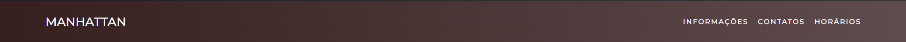

Note que ao passar o mouse em cima dos links, eles fazem uma animação e mudam de cor suavemente (Link do vídeo no meu Linkedin :D):

    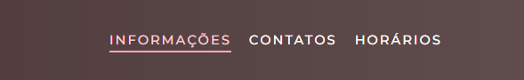

    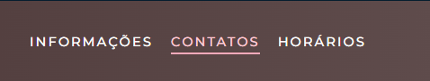

    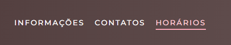

Logo abaixo da Navbar, há uma capa com o nome da cafeteria em branco de grande escala, juntamente com uma imagem de fundo que está fixa:

    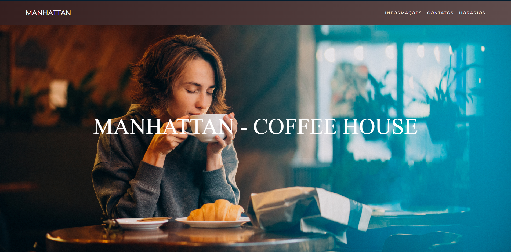

Descendo um pouco temos as seções contendo informações da cafeteria, também com imagens fixas de fundo, dando o efeito "PARALLAX":

    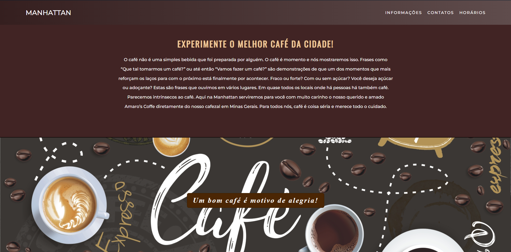

    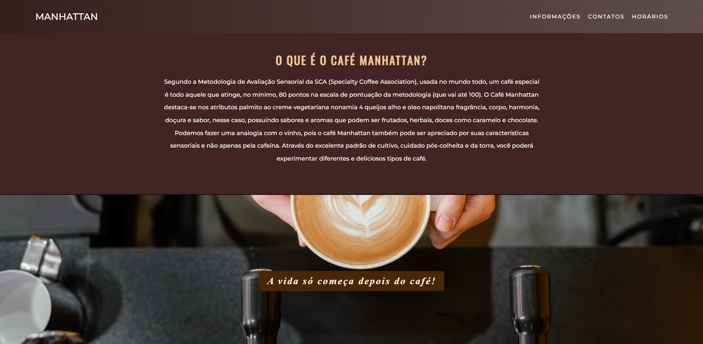

    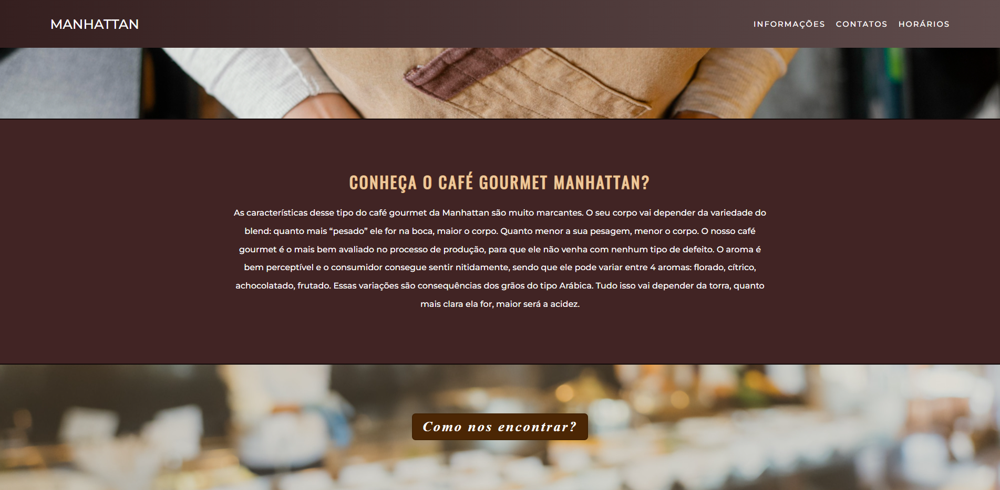

Na seção abaixo é apresentado um mapa interativo, importado do google maps para uma melhor orientação do usuário:

    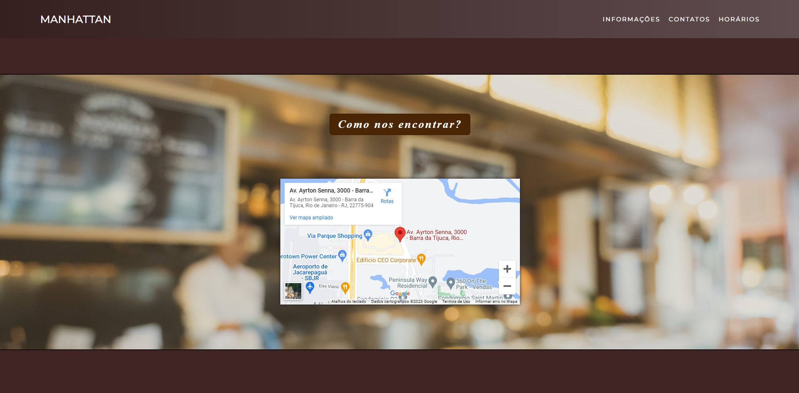

Logo abaixo é apresentado para o usuário um quadro com os horários de funcionamento da cafeteria:

    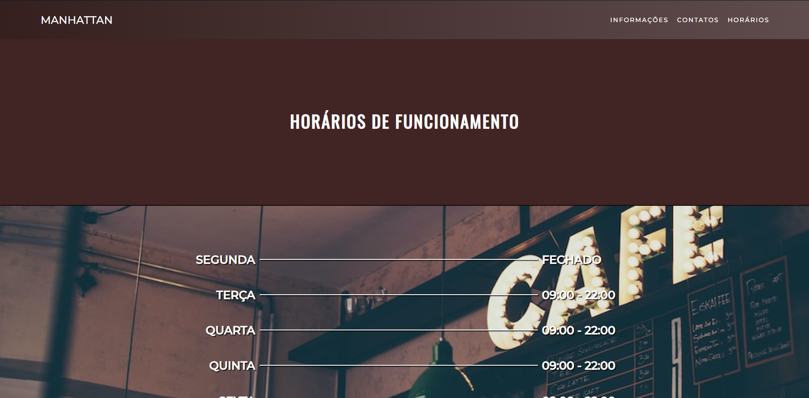

    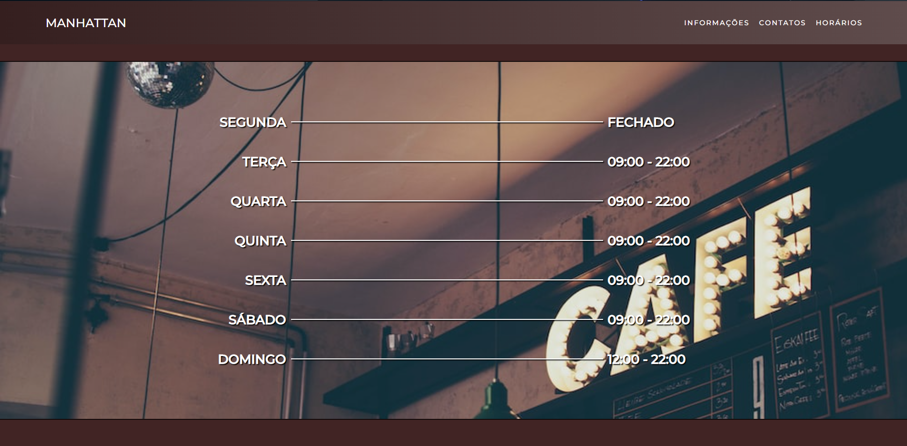

Temos também a seção de contatos, no qual o usuário pode estar entrando em contato com a cafeteria pelos meios disponíveis. Há também o rodapé, onde mostra os direitos e por que o site foi desenvolvido.

    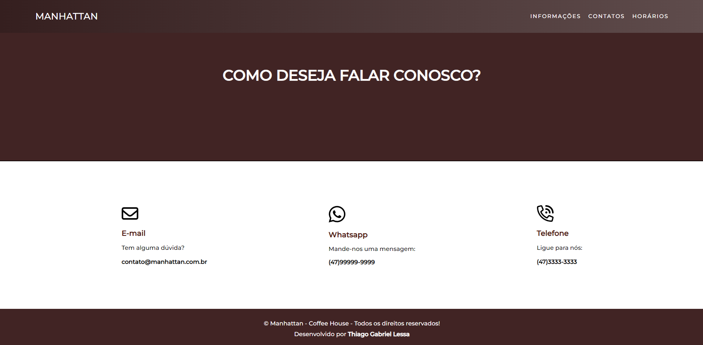

O site se ajusta a diferentes tamanhos de tela também, como para computadores, tablets e celulares:

    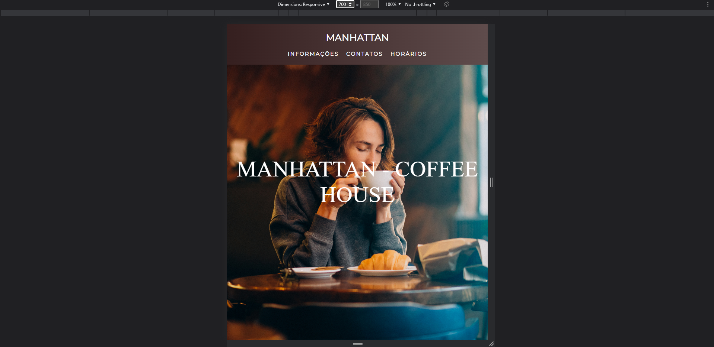

    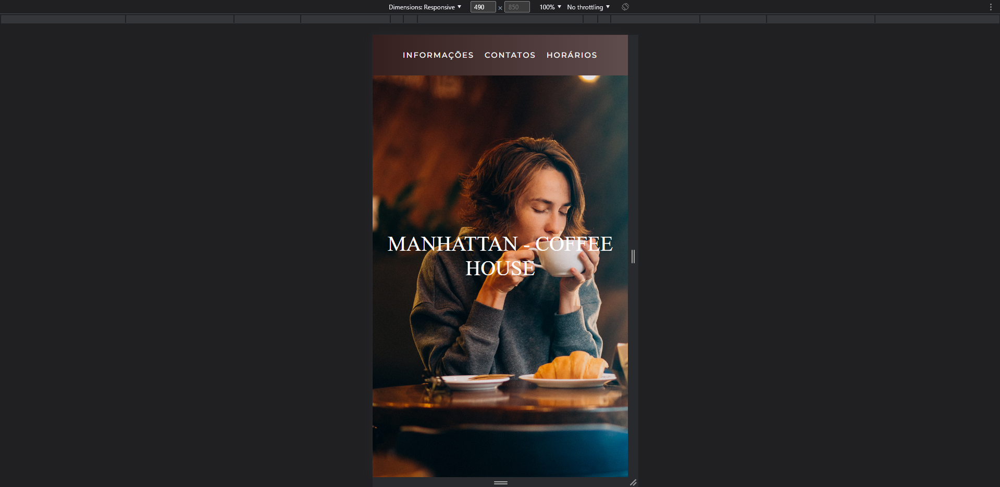

    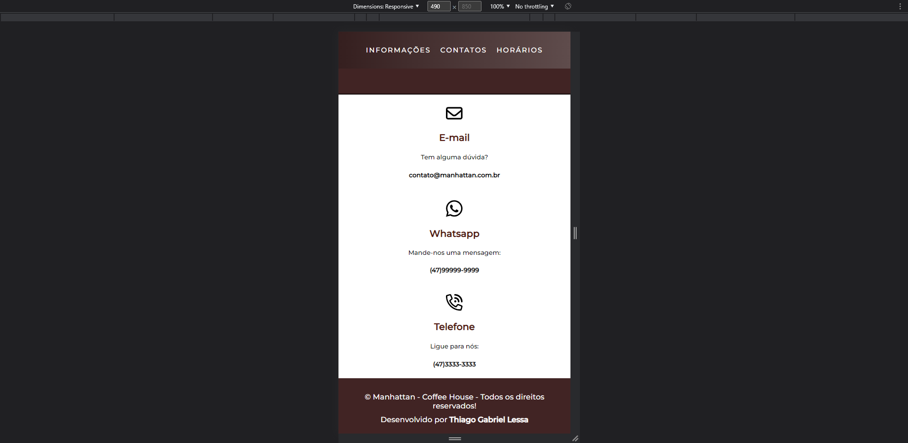

    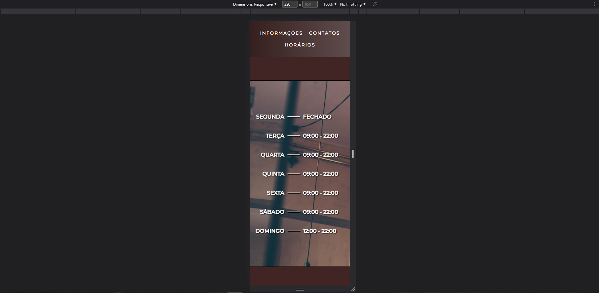

